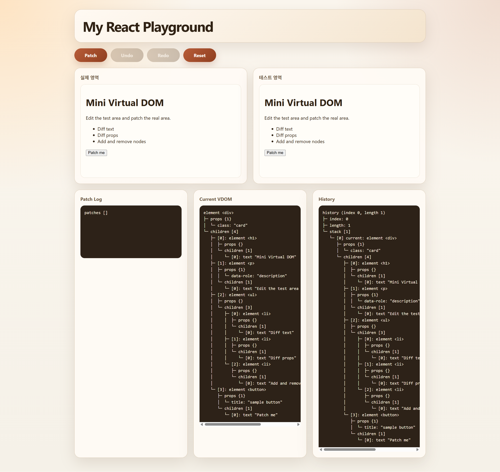
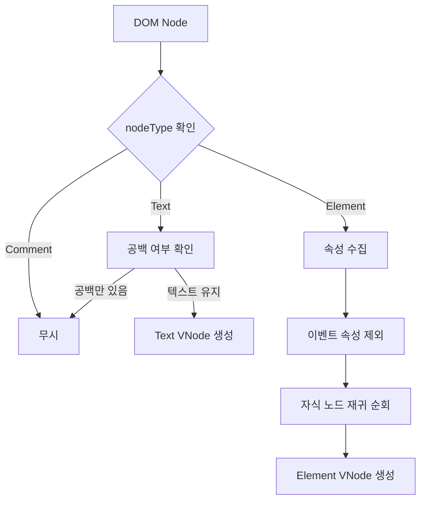
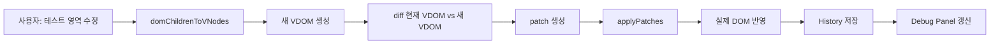
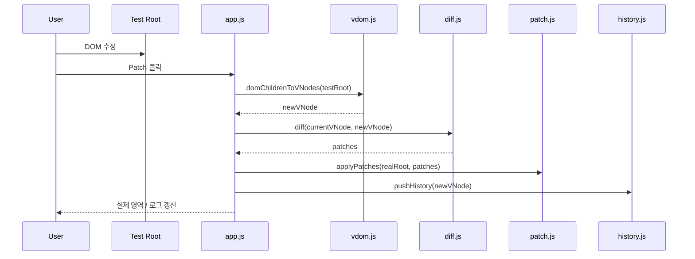
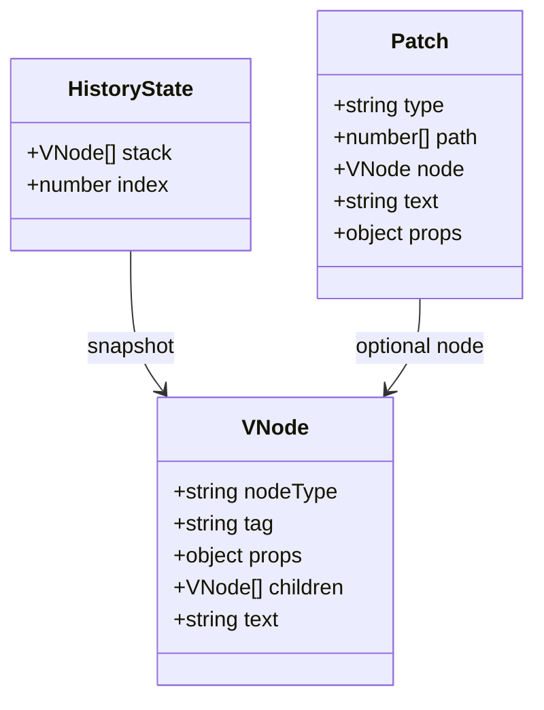
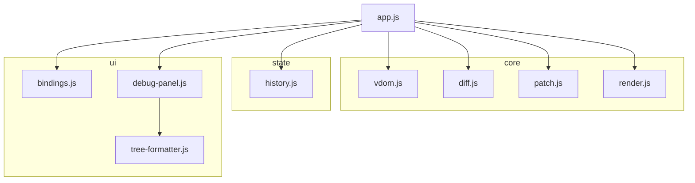

# My React Playground


브라우저의 실제 DOM을 Virtual DOM으로 변환하고, 이전 상태와 새 상태를 비교해 변경된 부분만 patch로 반영하는 Vanilla JavaScript 프로젝트입니다.

## Overview



- DOM -> VDOM 변환
- VDOM diff 계산
- patch 기반 부분 업데이트
- `Patch`, `Undo`, `Redo`, `Reset`
- `Patch Log`, `Current VDOM`, `History` 디버그 패널 제공

## DOM -> VDOM

이 프로젝트는 테스트 영역이나 실제 렌더링 영역의 DOM을 읽어서 `VNode` 트리로 변환합니다.  
변환은 [`src/core/vdom.js`]의 `domToVNode`, `domChildrenToVNodes`를 중심으로 처리됩니다.

### 변환 흐름



### 변환 예시

```html
<div class="card">
  <h1>Hello</h1>
  <p title="intro">Virtual DOM</p>
</div>
```

```js
{
  nodeType: "element",
  tag: "div",
  props: { class: "card" },
  children: [
    {
      nodeType: "element",
      tag: "h1",
      props: {},
      children: [{ nodeType: "text", text: "Hello" }]
    },
    {
      nodeType: "element",
      tag: "p",
      props: { title: "intro" },
      children: [{ nodeType: "text", text: "Virtual DOM" }]
    }
  ]
}
```

## Rendering And Patch Flow

초기 렌더링은 샘플 HTML을 읽어 VDOM으로 만든 뒤, 이를 테스트 영역에 렌더링하는 방식으로 시작합니다.  
이후 사용자가 테스트 영역을 수정하면 새 VDOM을 만든 뒤 diff 결과만 실제 DOM에 반영합니다.

### 업데이트 흐름



### Patch 버튼 기준 처리 순서



## Core Data Structures



## Patch Types

- `CREATE`
- `REMOVE`
- `REPLACE`
- `TEXT`
- `PROPS`

## Architecture



## Project Structure

```text
src/
  app.js
  core/
    vdom.js
    diff.js
    patch.js
    render.js
    dom-utils.js
    path-utils.js
  state/
    history.js
  ui/
    bindings.js
    debug-panel.js
    tree-formatter.js
  styles/
    main.css
tests/unit/
assets/
docs/
```

## Tech Notes

- Vanilla JavaScript ESM 기반
- index 기반 children diff
- 히스토리 스택 기반 `Undo` / `Redo`
- 단위 테스트: `node:test`
- CI: GitHub Actions

## Limitations

- children diff는 index 기반이라 reorder 최적화는 지원하지 않습니다.
- 이벤트 핸들러 diff는 지원하지 않습니다.
- 복잡한 form 상태 동기화까지는 다루지 않습니다.
