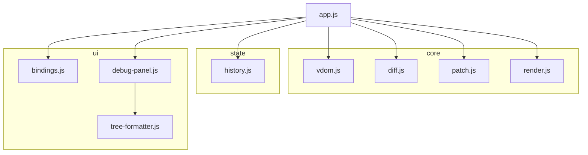
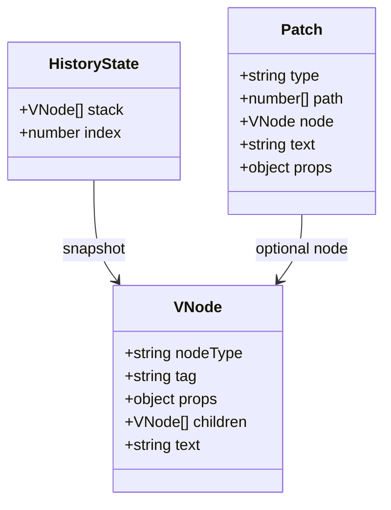

# Mini Virtual DOM Playground

브라우저의 실제 DOM을 Virtual DOM으로 변환하고, 이전 상태와 새 상태를 비교해 변경된 부분만 patch로 반영하는 Vanilla JavaScript 프로젝트입니다.

## Overview

- DOM -> VDOM 변환
- VDOM diff 계산
- patch 기반 부분 업데이트
- `Patch`, `Undo`, `Redo`, `Reset`
- `Patch Log`, `Current VDOM`, `History` 디버그 패널 제공

## Why

이 프로젝트는 "화면 전체를 다시 그리는 대신, 바뀐 부분만 업데이트한다"는 Virtual DOM의 핵심 개념을 직접 구현하고 시각적으로 확인하는 데 목적이 있습니다.

## Architecture

### 전체 동작 흐름


### 모듈 구조



### 핵심 데이터 구조



## Patch Types

- `CREATE`
- `REMOVE`
- `REPLACE`
- `TEXT`
- `PROPS`

## Project Structure

```text
src/
  app.js
  core/
    vdom.js
    diff.js
    patch.js
    render.js
    dom-utils.js
    path-utils.js
  state/
    history.js
  ui/
    bindings.js
    debug-panel.js
    tree-formatter.js
  styles/
    main.css
tests/unit/
assets/
docs/
```

## Tech Notes

- Vanilla JavaScript ESM 기반
- index 기반 children diff
- 히스토리 스택 기반 `Undo` / `Redo`
- 단위 테스트: `node:test`
- CI: GitHub Actions

## Limitations

- children diff는 index 기반이라 reorder 최적화는 지원하지 않습니다.
- 이벤트 핸들러 diff는 지원하지 않습니다.
- 복잡한 form 상태 동기화까지는 다루지 않습니다.

## Run

```bash
npm test
```

## Presentation Docs

- 발표 대본: `docs/PRESENTATION_SCRIPT.md`
